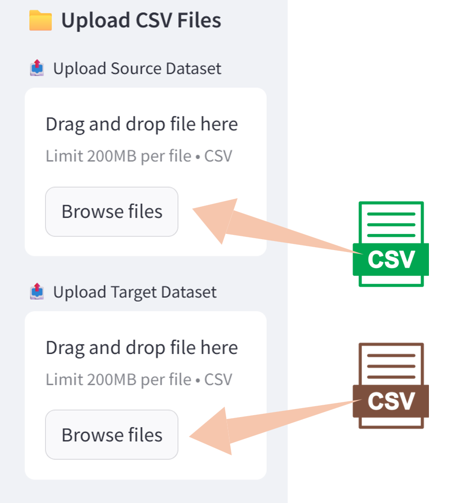
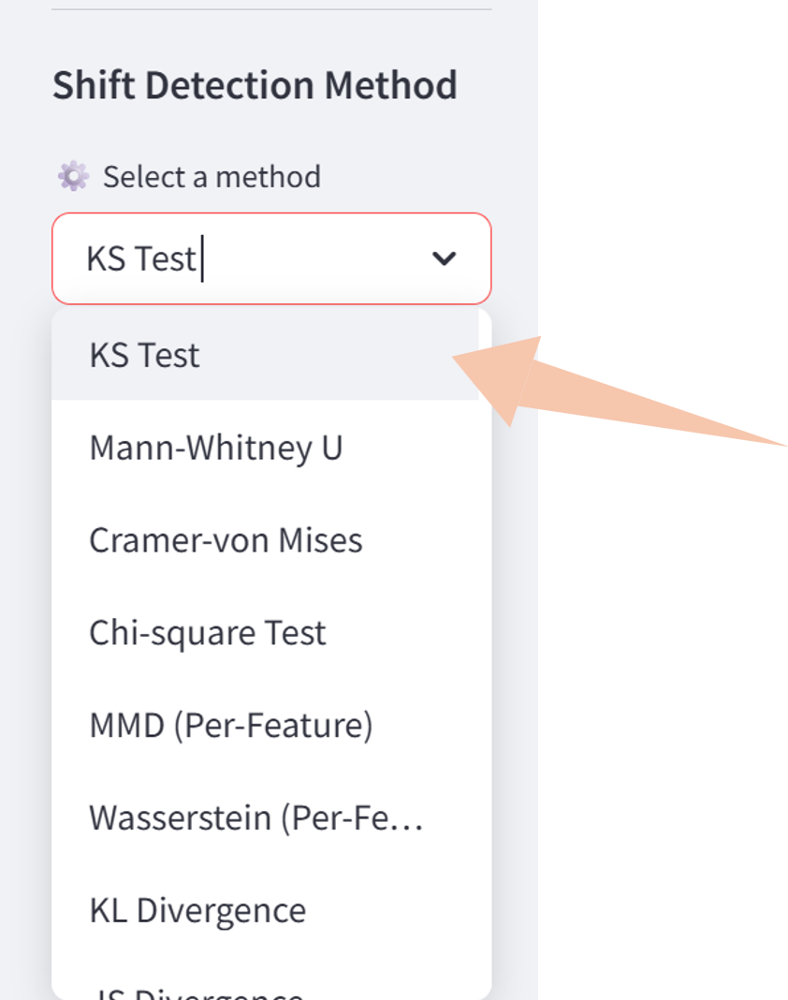
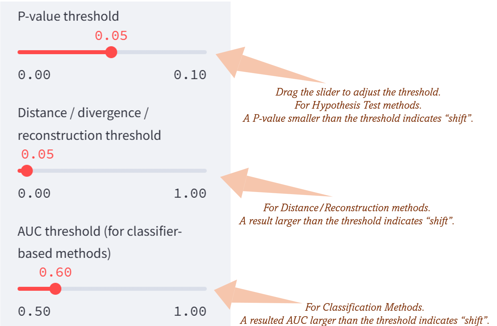
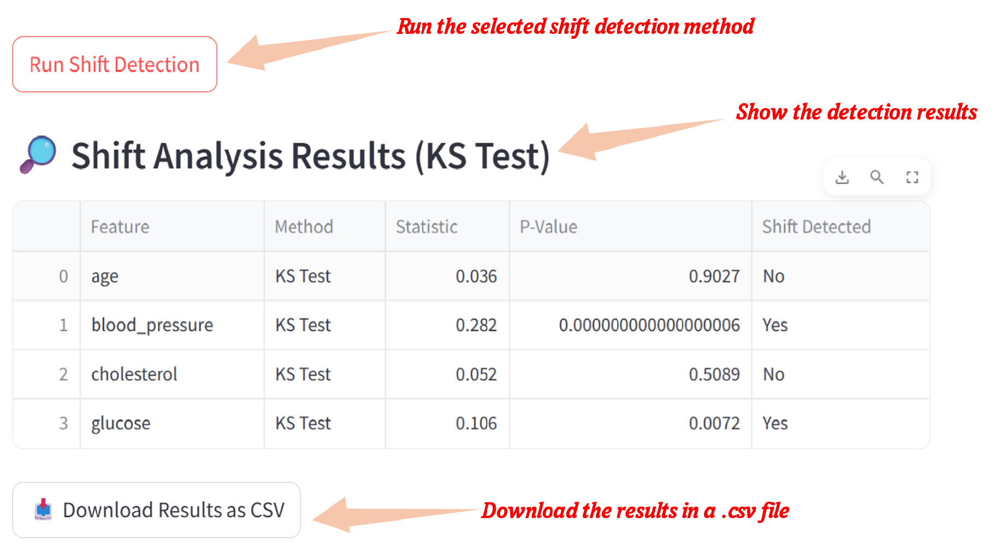
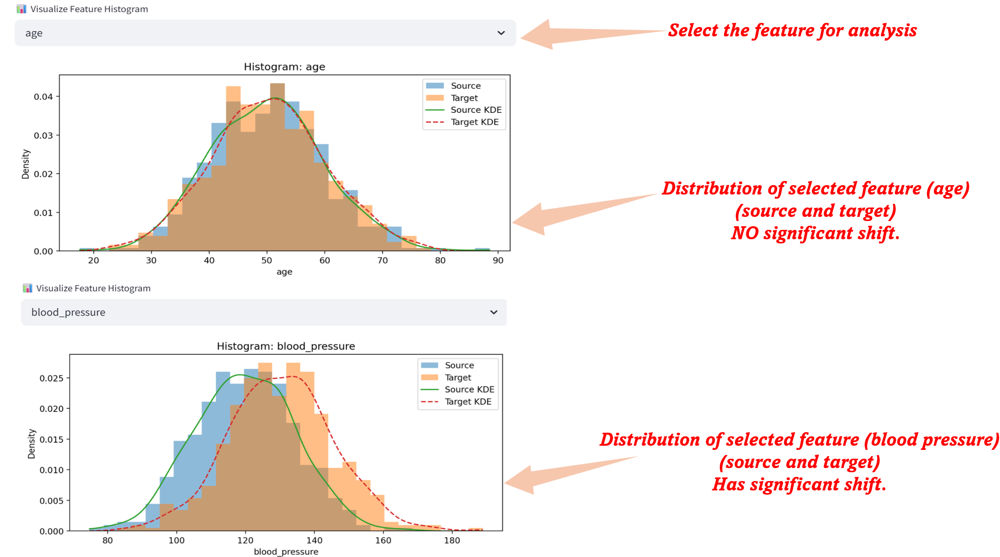
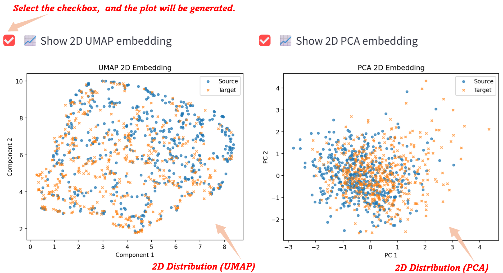

<p align="center">
  
  <span style="font-size:30px; font-weight:700; vertical-align:middle;">
    DomainSAT: Domain Shift Analysis Toolbox
  </span>
</p>
<p align="center">
  <strong><em>
    A lightweight GUI Python toolbox for detecting, visualizing, and understanding data shift.
  </em></strong>
</p>

---

## ✨ Overview

**DomainSAT** is a simple, powerful, and interactive **domain shift analysis toolbox** built in **Python**.
It runs on macOS, Linux, and Windows directly through a browser-based interface, with **no installation and no coding required**. It helps researchers and practitioners easily detect, quantify, and visualize domain shift across datasets. 

### 🔎 **Shift Detection Methods**

- **Univariate Statistical Tests**
   - Kolmogorov–Smirnov (KS)
   - Mann–Whitney U
   - Cramér–von Mises
   - Chi-square (categorical)
   
- **Distance & Divergence Metrics**
   - MMD (per-feature)
   - MMD (multivariate)
   - Wasserstein distance (per-feature)
   - Wasserstein distance (multivariate)
   - KL Divergence
   - JS Divergence
   - Mahalanobis distance
   
- **Classifier-Based Drift Detection**
   - Domain classifier (AUC-based)
   - C2ST – Logistic Regression
   - C2ST – Random Forest

- **Representation-Based Detection**
  - Autoencoder


### 📊 **Visualization**

  - Per-feature distributions (Histogram + KDE (kernel density estimation) Curve)
  - UMAP embedding (2D projection)
  - PCA projection (2D projection)
  - Interactive feature selection

---

## 🔧 Prerequisites

One of the core design goals of DomainSAT is **simplicity**:  
- You do **NOT** need to install the package system-wide, build wheels, or configure environments.  
- Just **copy the project folder** to any location and run it directly.

### ✔️ What you must have

- **Python 3.8+** installed  
  (Windows, macOS, or Linux all supported)

- A modern **web browser**  
  (Chrome, Safari, Firefox, Edge, ...)

### ✔️ Minimal Python dependencies

DomainSAT requires only a few lightweight packages:
- streamlit  umap-learn
- numpy, pandas, scikit-learn, scipy, matplotlib (typically pre-installed in most environments)

You may install them using **pip**:
```
pip install streamlit umap-learn numpy pandas scikit-learn scipy matplotlib
```

or using **conda**:
```
conda install -c conda-forge streamlit numpy pandas scikit-learn scipy umap-learn matplotlib
```
<hr style="height:4px; background-color:#ddd; border:none;">

## 🚀Usage
### 👉Start

Place the project folder anywhere on your computer. Once dependencies are installed, simply open a terminal (or Command Prompt on Windows), and run (in the path of the project folder):

```
streamlit run DomainSAT.py
```

Then the toolbox will launch in your browser. The first startup may take some time (approximately 20 seconds).

---
### 👉Upload your datasets

Upload two CSV files:
1. **Source dataset**
2. **Target dataset**

DomainSAT will automatically detect the shared features and prepare the data for analysis.

> **Note:**  
> The first row of each CSV must contain the feature names (column headers).  
> If your data consists only of embeddings without headers, please insert a header row (e.g., `f1, f2, f3, ...`) before loading.

For convenience, several **sample datasets** are provided in the folder **`Exp Data`** for quick testing and validation.

<p align="center">
  
</p>
---

### 👉Choose a domain shift-detection method

From the list, you can choose one shift detection method. Currently, DomainSAT provides several categories of methods:

- **Statistical tests:** KS, Mann-Whitney U,  Cramér-von Mises, Chi-square
- **Distance-based:** MMD, Wasserstein, Mahalanobis, KL/JS Divergence
- **Classifier-based:** Domain classifier (AUC), C2ST (Logistic), C2ST (Random Forest)
- **Representation-based:** Autoencoder

<p align="center">
  
</p>

Adjust method-specific parameters (p-value threshold, distance threshold, AUC threshold, etc.) from the sidebar.
<p align="center">
  
</p>
---

### 👉Run the analysis

Click "Run Shift Detection" button, DomainSAT will compute shift metrics and display:
- Summary table of results
- Whether shift is detected (per feature or global)
- Downloadable CSV report

<p align="center">
  
</p>
---

### 👉Visualize the shift

#### Feature-level histograms
- You can select any feature to inspect and visualize its distribution as a histogram for both the source and target datasets.
- For each feature, overlay **source vs target** distributions with KDE curves for easy inspection.

<p align="center">
  
</p>

#### Set-level distribution

DomainSAT provides two projection methods: ***UMAP*** and ***PCA***, that reduce high-dimensional data into a 2D space for visualizing the distribution of source and target datasets. Simply click the checkbox, and the corresponding visualization will be generated. 

Note: UMAP typically takes longer time to compute, while PCA is much faster.

<p align="center">
  
</p>

---
